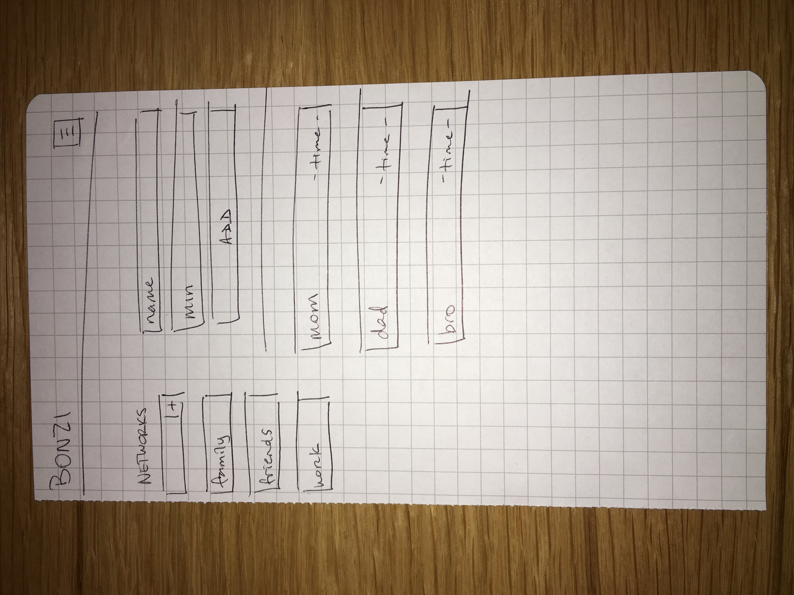

# Description

# Technologies
1. MondoDB
2. ExpressJS
3. AngularJS
4. NodeJS
5. Bootstrap
6. Animate.css

# User Stories
1. John wants to keep in touch with his friends. He installs BONZI and creates a network called friends. In that network he creates a list of several of his friends. When he creates each friend, he decides how often he wants to reach out to them.
2. Noel wants see how well he is keeping in touch with his family overseas. He logs into BONZI and see several contacts have timed out and turned red. He now knows to contact his relatives.

# Wireframes

# Heroku
